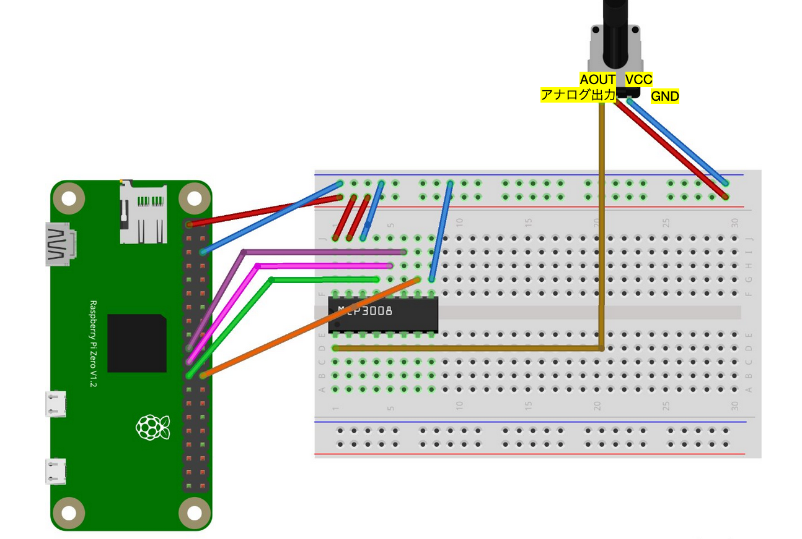

# Raspberry Pi Soil Moisture Sensor

## Requirements
- Raspberry Pi (Zero 2 W)
- `Capaitive Soil Moisture Sensor V1.2`
- AC/DC Converter (MCP3008)
- Jumper wires

## Breadboard Diagram

## How to use
1. git clone
2. `uv sync`
3. `uv run main.py`
